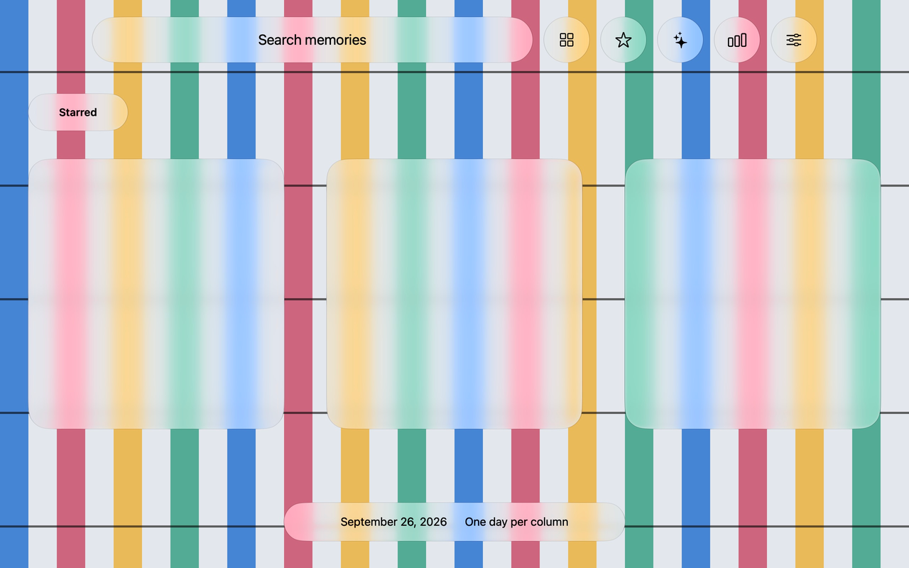
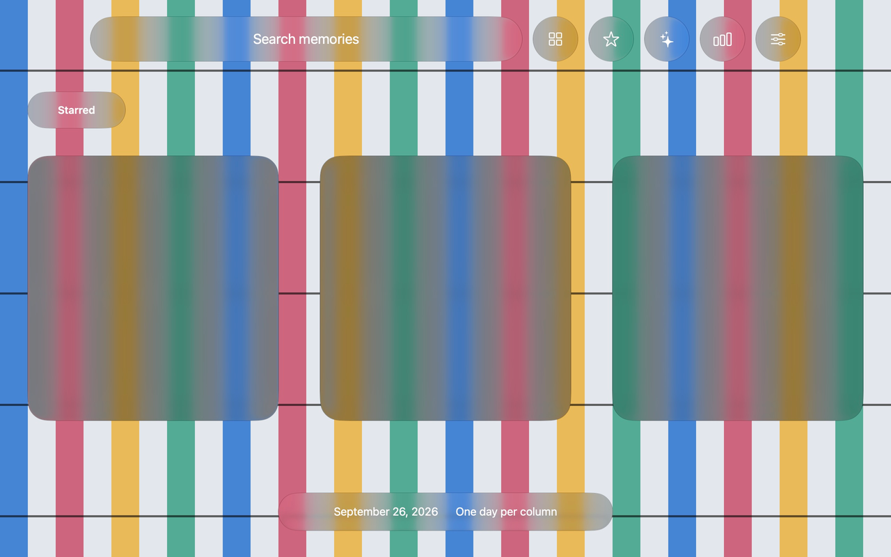
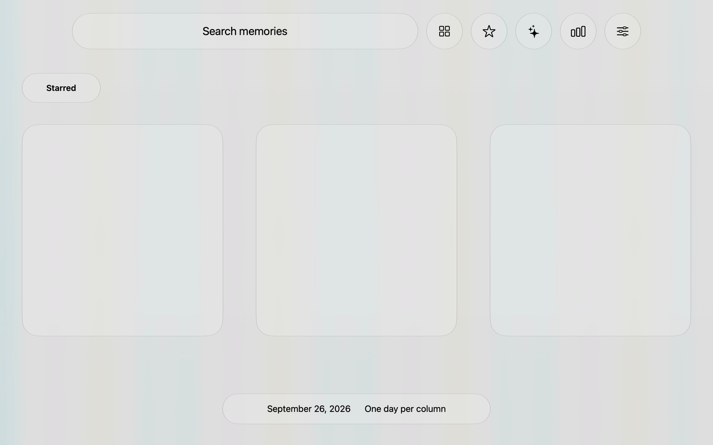
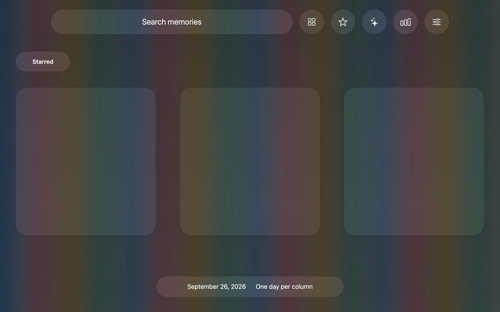

# Mac visual references

These saved references let another development machine compare the Windows implementation without access to the original Mac. Assets live in [macos-visual-reference/](macos-visual-reference/); [manifest.json](macos-visual-reference/manifest.json) records dimensions, capture method and SHA-256 checksums. All application content is synthetic.

## Native glass captures

The four cases were captured onscreen from [MaterialReference.swift](../macOS/Tools/MaterialReference.swift), using native SwiftUI liquid glass. Each has an untouched 2560 × 1600 JPEG capture with its display ICC profile in `native-glass/original/`, and an existing color-normalized 1280 × 800 PNG in `native-glass/srgb/`. The source captures had `.png` filenames despite containing JPEG bytes; the uploaded originals use the correct `.jpg` extension without re-encoding.

The normalized images were converted from the embedded display profile to sRGB, then resized with Lanczos to the shared logical dimensions. They retain the original JPEG capture artifacts. Use these PNGs for Windows comparison; use the originals for closer inspection or different color-management/resampling choices.

| Case | Appearance | Underlying material | Normalized reference |
| --- | --- | --- | --- |
| `mac-material-light` | Light | Sharp colored stripes | [PNG](macos-visual-reference/native-glass/srgb/mac-material-light.png) |
| `mac-material-dark` | Dark | Sharp colored stripes | [PNG](macos-visual-reference/native-glass/srgb/mac-material-dark.png) |
| `mac-background-light` | Light | In-window background blur | [PNG](macos-visual-reference/native-glass/srgb/mac-background-light.png) |
| `mac-background-dark` | Dark | In-window background blur | [PNG](macos-visual-reference/native-glass/srgb/mac-background-dark.png) |






The background cases use `NSVisualEffectView` with `.withinWindow`; per-window capture does not include behind-window sampling correctly. They are useful for material tuning, but do not establish exact desktop-blur equivalence. No Windows fidelity percentage or animation/performance result is implied by these static references.

## Application layout baseline

[app-baseline/](macos-visual-reference/app-baseline/) contains all 16 original 2560 × 1600 captures: classic and Rhine Lab home, results and filtered search in both appearances; expanded Rhine cards in both appearances; recording and storage settings. [environment.json](macos-visual-reference/app-baseline/environment.json) preserves the original capture date, macOS build and 2× backing scale. Logical size is 1280 × 800.

These were generated by [VisualParityReferenceTests.swift](../macOS/Tests/RewindTests/VisualParityReferenceTests.swift) using actual SwiftUI/AppKit views, SceneKit snapshots and `cacheDisplay`. Use them for layout, content, card projection and artwork. **`cacheDisplay` does not faithfully capture compositor-owned glass.** Missing/flat control materials in these files must not be treated as the desired native-glass appearance; use the onscreen glass captures above for that comparison.

## Shared fixture data on Windows

[fixtures/](macos-visual-reference/fixtures/) includes the same 60 generated images and `fixture.json` used for the Mac baseline. It covers five days and three fictional applications. Database files, local settings, connection files and real recordings are excluded. The fixture generator is already in `VisualParityReferenceTests.swift`.

From the repository root in PowerShell, after publishing `release/glass-probe` as described in [windows-liquid-glass.md](windows-liquid-glass.md):

```powershell
$validation = Join-Path $PWD '.test-data\mac-reference-validation'
New-Item -ItemType Directory -Force $validation | Out-Null
Copy-Item -Recurse -Force '.\docs\macos-visual-reference\fixtures' $validation
Start-Process -FilePath '.\release\glass-probe\Recall.exe' -ArgumentList ('--visual-parity "{0}"' -f $validation)
```

Use the interactive Windows desktop at 1280 × 800 with 100% scaling. A new validation directory uses local `control.json` commands and does not require the old development machine or its optional HTTP transport.

For the application-state matrix, run the existing script after `environment.json` appears:

```powershell
.\scripts\test-windows-visual-parity.ps1 -Directory $validation -Round 'mac-reference'
```

For a native-glass comparison instead, write an individual command:

```powershell
$command = @{ name='material-light'; material=$true; dark=$false; desktop=$false; settleMs=3000 }
[IO.File]::WriteAllText((Join-Path $validation 'control.json'), ($command | ConvertTo-Json), [Text.UTF8Encoding]::new($false))
```

Set `dark=$true` and a different `name` for the dark case. Set `desktop=$true` and `stripedBackdrop=$true` to exercise the Windows host-background path; the Mac background reference uses the in-window path noted above. Each result is written under `<validation>/<name>/` with `metrics.json`; `completed.json` reports success or failure. Glass numeric overrides and `fallback=$true` are documented in the harness source.

For all image comparisons, match logical geometry and color profiles first. Compare material interiors, rims, blur transitions and text separately. A whole-screen score dominated by shared background pixels cannot establish 90% visual fidelity.
