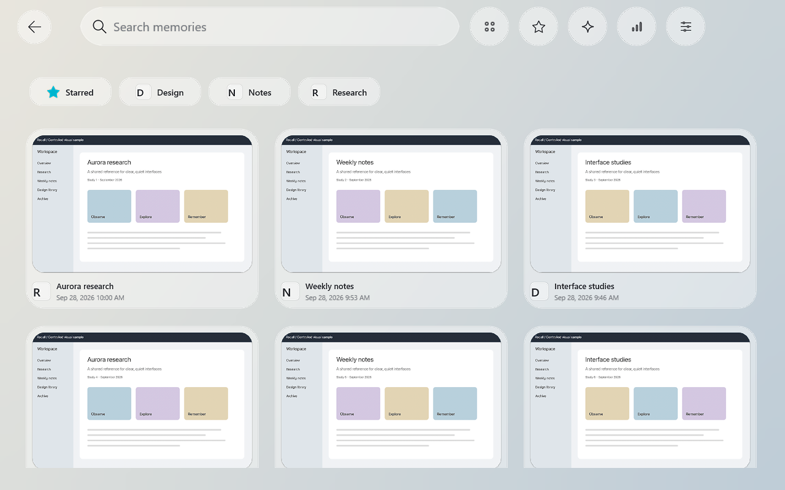
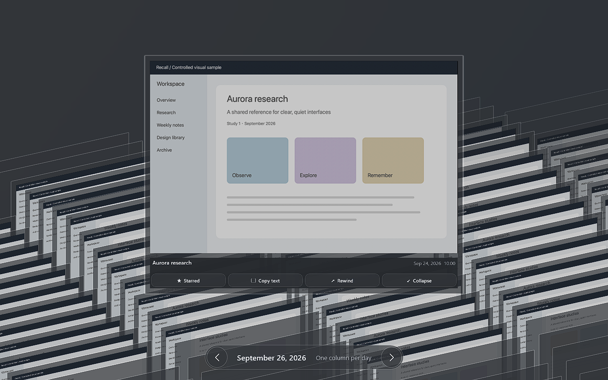
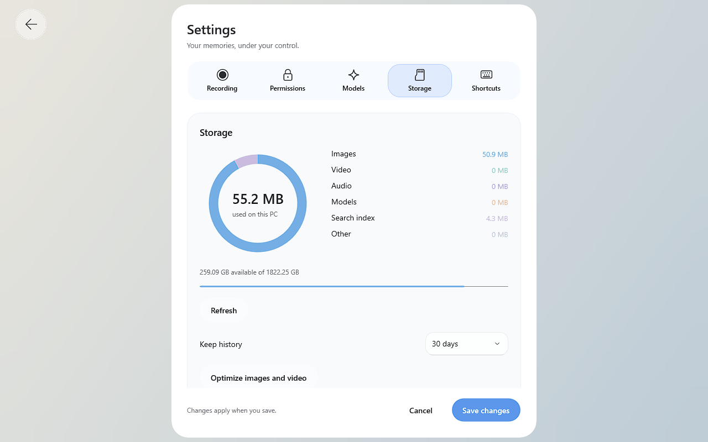

# Windows visual parity

Work branch: `feat/windows-visual-parity`, based on macOS release `bb3d587`.
This is an unsigned Windows development build, not a main-branch release.

The subsequent liquid-glass implementation and native evidence are documented
in [the 2026-09-27 validation](windows-glass-validation-2026-09-27.md). Measurements
later in this document refer to the earlier checkpoint unless explicitly stated.

## Reference and isolation

The reference uses 60 generated screenshots, five days and three fictional
applications, anchored at September 26, 2026. The same manifest and image bytes
feed macOS and Windows. Tests never open the user's recording library or start
recording.

The [committed Mac reference bundle](macos-visual-reference.md) includes all 16
layout captures, the 60 shared fixture images and separate onscreen native-glass
references, with setup instructions for another machine.

The opt-in macOS export renders actual SwiftUI/AppKit views and inserts SceneKit
snapshots before `cacheDisplay`. Its 16 captures provide layout/artwork evidence;
compositor-owned glass is not faithfully captured by that API. They must not be
presented as pixel-perfect native-material references.

```sh
RECALL_PARITY_REFERENCE="$PWD/.test-data/windows-parity/macos-baseline" \
  swift test --package-path macOS --filter VisualParityReferenceTests
```

`RECALL_PARITY_WIDTH` and `RECALL_PARITY_HEIGHT` select logical dimensions
(default 1280 × 800). macOS captured at 2×; Windows at 1×. Match logical geometry
when comparing; fonts, antialiasing and compositor materials differ.

## Changes

- Persistent native search editor and toolbar survive navigation. Custom control
  templates keep the native editor and placeholder behavior. Toolbar targets are
  64 logical pixels; text and icons follow the selected appearance.
- Results share a continuous page backdrop, glass filter capsules and three
  columns. Integer card widths account for XAML layout rounding. Dark screenshots
  are dimmed against opaque black to avoid showing other cards through them.
- Rhine Lab Mode retains card surfaces and animates Composition transforms. Its
  camera, projection, hit coordinates and damped springs use the macOS parameters.
  Images, metadata and actions stay under one transformed card root. The lifted
  card stays above the wall; action buttons disappear during collapse. Timeline
  presentation hides the day pill and hover caption.
- Pointer moves retarget only when the card changes. Animation stops when springs
  settle, and hidden pages stop their animation/timeline clocks. Relative depth
  crossings, rather than every floating-point depth update, change XAML Z order.
- Imported PNG/JPEG thumbnails now obey the size limit, as tiled archives already
  did. This fixes retention of full-size images in the wall. Two concurrent loads,
  cancellation, a 48 MB encoded cache and 72 MB decoded cache bound repeat work.
  Visible images can retain decoded pixels beyond the cache's own budget.
- Settings build only the selected tab. The 660-pixel panel has a selected tab
  indicator and label/control rows. Appearance is offered only with Rhine Lab
  Mode enabled. Storage measurement runs off the UI thread, shares in-flight
  work, caches briefly and refreshes after cleanup.
- Startup fixes register the code-only WinUI metadata provider, initialize
  resources in `OnLaunched`, publish the merged `resources.pri`, and use a
  supported backdrop effect instead of an unsupported mask-brush source.

## Windows validation

Target: Windows 11 Pro 22621, AMD Custom APU 0405, 4 cores / 8 logical processors,
14.8 GiB RAM. Tests ran in an interactive RDP session at 1280 × 800, scale 1.

Three native build/capture/review rounds each covered 17 states: classic and Rhine,
light and dark, home/results/filtered search, expanded cards, recording/storage
settings and timeline. A final 17-state pass plus 24 expansion and 24 collapse
frames exercised full animation after detecting that RDP disabled OS animations.
The validation-only override does not change Windows preferences; normal launches
continue honoring reduced motion.

| Round | Findings and changes | Observed peak working set |
| --- | --- | ---: |
| 1 | Startup repaired; found two-column wrapping, slow black thumbnails, narrow settings | 1,613 MB |
| 2 | Three columns, bounded thumbnails/caching, readable search placeholder, full panel width | 254 MB |
| 3 | Opaque dark image backing, selected settings tabs, cancellation and reduced Z-order churn | 251 MB |
| Final, animations enabled | Kept extracted card in front; checked expansion/collapse frames and continuous spring retargeting | 292 MB |





The [first-round results](windows-visual-parity-evidence/round1-results.png) retain
the original wrapping defect for comparison. Raw sample metrics and environment
are in [measurements.json](windows-visual-parity-evidence/measurements.json).
Complete Windows capture archives remain in `.test-data/windows-parity/` and on
the target under `D:\RecallDevelopment\visual-validation`. Mac baseline captures
and synthetic fixture data are committed in `docs/macos-visual-reference/`.

### Measurements

CPU percentages below use one logical core as 100%, not whole-machine Task Manager
percentages. Samples include final screenshot overhead. These are controlled
60-record tests, not large-library benchmarks.

| Test | Duration | CPU time | One-core CPU | Working set |
| --- | ---: | ---: | ---: | ---: |
| 80 spring retargets, 250 ms apart | 20.82 s | 156.25 ms | 0.75% | 236 MB |
| Rhine idle, no rendering observer | 20.06 s | 15.63 ms | 0.078% | 235 MB |
| Classic idle, no rendering observer | 20.06 s | 15.63 ms | 0.078% | 233 MB |
| Storage idle | 5.07 s | 0 ms at timer resolution | 0% observed | 234 MB |

Spring-sweep rendering callback intervals: p95 31.70 ms, maximum 62.79 ms.
Callbacks measure UI scheduling under RDP, **not GPU present time or physical
screen FPS**. Expansion/collapse capture CPU includes 24 screen grabs; it is not
comparable with the idle samples. Both idle tests confirm the Rhine animation
clock stopped; all 60 wall images loaded without failures.

Real RDP input separately verified card opening, button/Escape collapse, wheel
scrolling, English search input and placeholder separation across navigation.
App-driven capture commands are distinct from those pointer/keyboard checks.

### Build and component checks

- C# source check: passed, zero warnings/errors.
- Core/database/privacy/projection/motion regression suite: 85 assertions passed.
- Native self-contained Windows publish and interactive launch: passed.
- Pinned offline neural OCR and Tesseract fallback: both recognized `Aurora` in a
  synthetic image (13 and 8 regions). The fixture PNG emits a nonfatal ICC-profile
  warning. No user screenshots were used.
- Bundled llama server `--version` and whisper CLI `--help`: exit 0. This checks
  binary loading, not actual model inference or transcription accuracy.
- All required OCR models, tessdata, runtime executables, PRI and icons verified
  in the package; third-party notices included.

## Reproducing the native captures

```powershell
dotnet publish Windows/Recall.WinUI/Recall.WinUI.csproj -c Release -r win-x64 `
  --self-contained true -p:Platform=x64 -o release/visual-parity
release/visual-parity/Recall.exe --visual-parity D:\RecallDevelopment\visual-validation
```

Place `fixture.json` and `frames/` under that directory's `fixtures/`. Run the
application in the interactive desktop, not SSH Session 0. The validation runner
uses a separate library, recording disabled and a controlled desktop backdrop.
`scripts/test-windows-visual-parity.ps1 -Directory <directory> -Round <name>`
drives the 17-state matrix through the app-owned `control.json` protocol.

```json
{
  "name": "rhine-motion",
  "rhine": true,
  "dark": false,
  "page": "home",
  "day": "2026-09-26",
  "motionSamples": 80,
  "frames": 1
}
```

Other fields: `query`, `app`, `selected` (fixture ID), `timeline`, `tab`,
`settleMs`, `measureSeconds`, `sampleRendering`, `captureOnly` and
`action: "collapse"`. `motionSamples` deliberately retargets the real spring
path; it does not synthesize physical pointer input. Use `sampleRendering: false`
for idle CPU measurement. This mode forces app animations for validation even
when RDP disables system animations.

## Delivery and remaining limits

Runnable folder on Windows:
`D:\RecallDevelopment\windows-visual-parity\release\visual-parity`.
The portable ZIP is `D:\RecallDevelopment\Recall-Windows-visual-parity-x64.zip`.
Run `Recall.exe` normally for the application, or the existing
`recall-visual-parity-20260926.cmd` launcher for isolated sample data.

The branch is not pixel-identical to SceneKit: depth-of-field blur, physically
based glass highlights, column captions and horizontal camera panning remain
unimplemented. The timeline hiding behavior was checked, but a full populated
cross-platform timeline comparison remains pending. Native IME composition,
physical-console GPU timing, fullscreen-app hotkey behavior, large libraries and
end-to-end recording/audio/model inference have not been validated in this pass.
The build is unsigned and has not been made a main-branch release.
